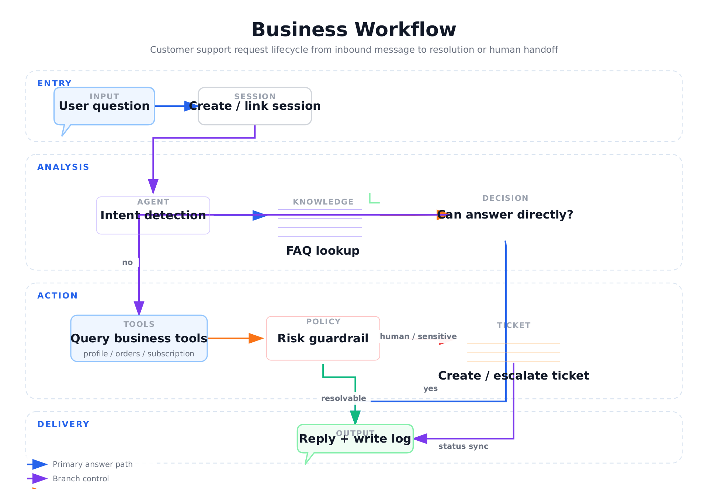
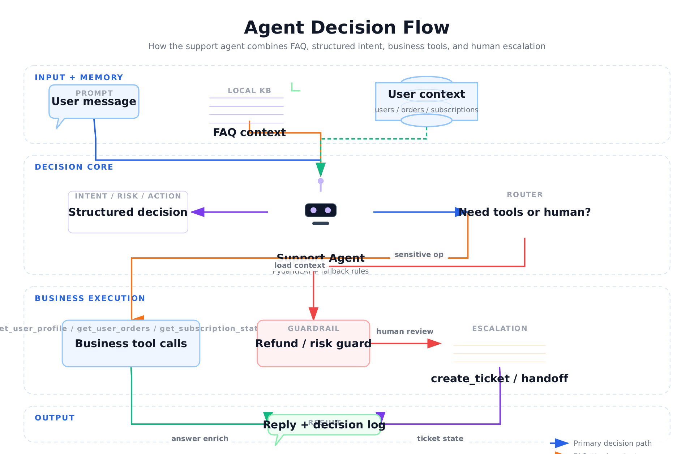
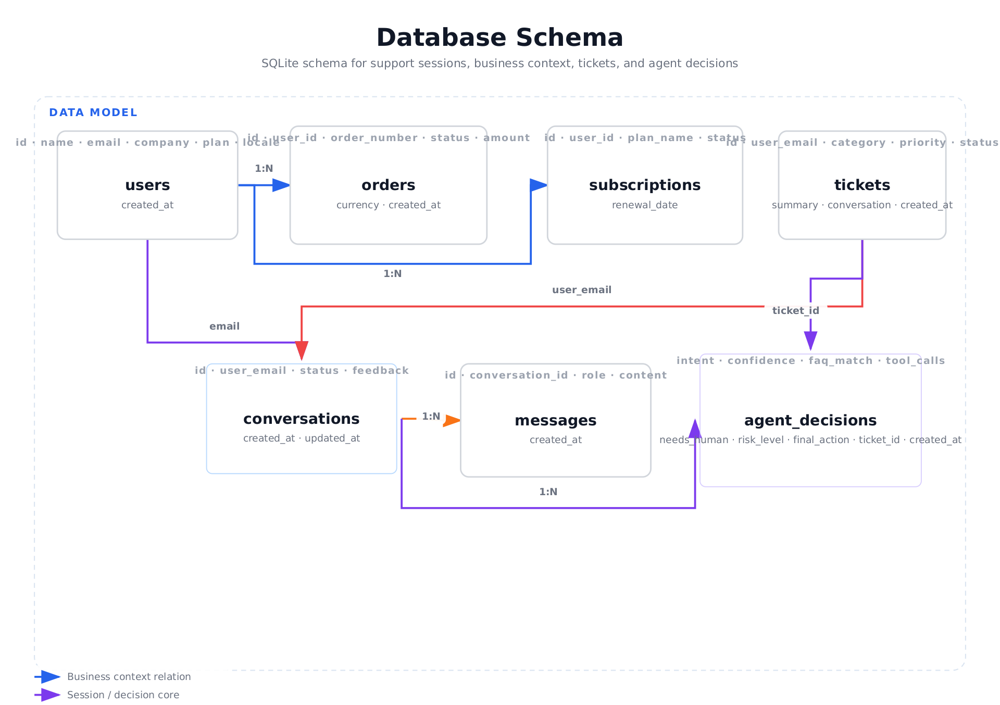
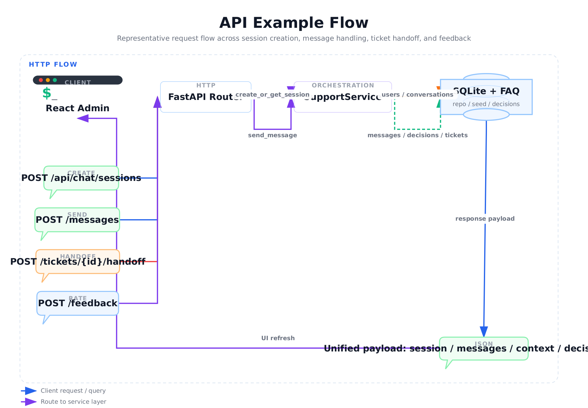
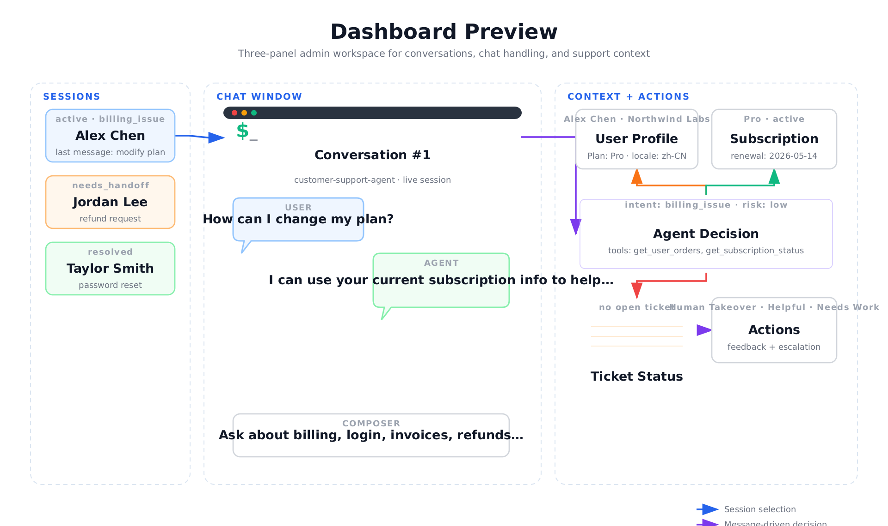

# customer-support-agent

一个面向 SaaS 场景的智能客服 Agent 项目，覆盖意图识别、FAQ 优先回复、业务工具调用、工单升级、人工接管、后台工作台和决策日志。

项目目标不是只做一个聊天 demo，而是尽量贴近真实客服场景里的支持链路：
- 用户消息进入后先落会话
- Agent 做结构化判断
- 命中 FAQ 时优先给出稳定回答
- 需要上下文时查询用户、订单、订阅
- 遇到高风险或无法闭环的问题时升级工单
- 后台同步展示会话、用户上下文、Agent 判断和工单状态

## 功能概览

- 6 类意图识别：`account_issue`、`billing_issue`、`refund_request`、`technical_problem`、`general_faq`、`human_support`
- FAQ 优先命中，本地 `seed/faq.json` 可直接维护
- 4 个业务工具：`get_user_profile`、`get_user_orders`、`get_subscription_status`、`create_ticket`
- SQLite 持久化：用户、订单、订阅、会话、消息、工单、Agent 决策日志
- React 三栏后台：会话列表、聊天窗口、用户上下文和 Agent 判断
- 高风险 guardrail：退款默认转人工并创建高优先级工单
- 会话满意度评价和人工接管按钮
- 支持 `.env` 加载与兼容 OpenAI 接口的自定义 `OPENAI_BASE_URL`

## 技术栈

- Backend: FastAPI, Pydantic, SQLite
- Agent: PydanticAI with rule-based fallback
- Frontend: React + Vite
- Testing: pytest
- Docs diagrams: SVG + PNG assets generated with `fireworks-tech-graph`

## 项目结构

```text
app/
  api/                FastAPI 路由
  agent/              Agent 决策逻辑
  repositories/       SQLite 数据访问
  schemas/            Pydantic 类型定义
  services/           FAQ、工具和客服编排
frontend/             React 后台
seed/                 FAQ 种子数据
tests/                单元与接口测试
docs/assets/          README 图示与预览图
```

## 本地运行

### 1. 安装后端依赖

```bash
python3 -m venv .venv
source .venv/bin/activate
pip install -e ".[dev]"
```

### 2. 启动后端

```bash
uvicorn app.main:app --reload
```

后端默认运行在 `http://127.0.0.1:8000`。

### 3. 启动前端

```bash
cd frontend
npm install
npm run dev
```

前端默认运行在 `http://127.0.0.1:5173`，并通过 Vite 代理访问后端 API。

### 4. 可选的模型增强

如果你想启用 `PydanticAI` 的模型调用能力，可以复制 `.env.example` 并设置：

```bash
pip install -e ".[llm]"
OPENAI_API_KEY=your_key
OPENAI_BASE_URL=https://your-openai-compatible-endpoint/v1
LLM_MODEL=your-model-name
```

如果没有配置模型密钥，系统会自动退回规则式 Agent，依然可以完整演示项目流程。

## 业务流程图



这张图对应项目中的主链路：
- 用户消息先进入会话层
- Agent 做意图识别与 FAQ 检索
- 可直接回答时返回结果并写入日志
- 需要上下文时调用业务工具
- 敏感操作或无法闭环时升级工单

## Agent 决策流程图



当前 Agent 的决策信号包含：
- `intent`
- `confidence`
- `faq_match`
- `tool_calls`
- `needs_human`
- `risk_level`
- `final_action`

其中“套餐 / 订阅”类问题不会被纯 FAQ 文案短路，而会继续结合订阅上下文返回更完整的回答。

## 数据库表设计



核心表如下：
- `users`: mock 用户资料
- `orders`: 用户订单记录
- `subscriptions`: 订阅状态
- `tickets`: 工单与状态流转
- `conversations`: 会话状态与满意度
- `messages`: 用户与 Agent 消息
- `agent_decisions`: 每次 Agent 决策日志

## API 示例



### 创建或恢复会话

```bash
curl -X POST http://127.0.0.1:8000/api/chat/sessions \
  -H "Content-Type: application/json" \
  -d '{
    "user_email": "alex@example.com"
  }'
```

### 发送消息

```bash
curl -X POST http://127.0.0.1:8000/api/chat/sessions/1/messages \
  -H "Content-Type: application/json" \
  -d '{
    "message": "如何修改套餐？"
  }'
```

返回结构统一围绕以下几块组织：
- `session`
- `messages`
- `context`
- `decision`
- `ticket`

### 人工接管

```bash
curl -X POST http://127.0.0.1:8000/api/tickets/1/handoff
```

### 满意度评价

```bash
curl -X POST http://127.0.0.1:8000/api/chat/sessions/1/feedback \
  -H "Content-Type: application/json" \
  -d '{
    "rating": "up"
  }'
```

## 截图



后台采用三栏布局：
- 左侧：会话列表与状态标签
- 中间：聊天窗口与输入框
- 右侧：用户信息、订阅状态、Agent 判断、工单状态和操作按钮

## 演示脚本

可以用下面四条典型流程做演示：

1. 重置密码
   - 用户输入：`如何重置密码？`
   - 预期：FAQ 命中，直接回复，不创建工单
2. 订阅与账单查询
   - 用户输入：`我的账单有问题，帮我看看最近订单和订阅状态`
   - 预期：触发订单与订阅工具调用，右侧面板显示上下文
3. 退款请求
   - 用户输入：`我想退款，请尽快处理`
   - 预期：命中高风险 guardrail，创建高优先级工单并提示人工确认
4. 人工转接
   - 用户输入：`帮我转人工客服`
   - 预期：创建工单，点击后台 `Human Takeover` 后状态变为 `handed_off`

## 测试说明

```bash
pytest
```

当前测试覆盖：
- 6 类意图识别
- FAQ 优先回复
- 业务工具调用
- 工单创建与高风险 guardrail
- 人工接管与满意度评价 API

典型测试文件：
- `tests/test_agent.py`
- `tests/test_api.py`

如果你改动了 Agent 决策逻辑，建议优先补充：
- FAQ 命中但仍需上下文回答的用例
- 新增高风险动作的 guardrail 用例
- 业务工具组合调用的端到端用例

## 后续 Roadmap

- 接入真实坐席体系，而不是演示级 handoff 标记
- 增加 FAQ 后台管理与运营可编辑能力
- 引入更细粒度的客服 SLA、优先级和标签系统
- 增加工单时间线、内部备注和状态审计
- 增加更真实的账单与退款工作流确认步骤
- 支持更多 OpenAI-compatible provider 的可配置模型路由
- 增加前端端到端测试与自动化截图产物

## 许可证

Apache-2.0
